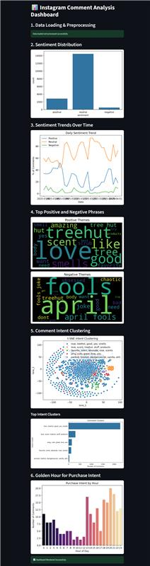

# 📊 Instagram Comment Trend Analysis Dashboard

This project analyzes ~18,000 Instagram comments for the brand `@treehut` using NLP techniques like sentiment analysis, keyword trends, clustering, and influencer discovery.

Built with:
- ✅ Python
- ✅ Streamlit (dashboard UI)
- ✅ VADER (sentiment analysis)
- ✅ Scikit-learn, pandas, matplotlib, seaborn, wordcloud
- ✅ Modular folder structure for maintainability
- ✅ Claude by Anthropic

---

## 📁 Project Structure

```
scrollmark-trend-analysis/
│
├── main.py                      # Entry point - Streamlit dashboard
├── data/
│   └── engagements.csv          # Pre-downloaded comment data (March 2025)
│
├── src/
│   ├── load_data.py            # CSV loader and initial setup
│   ├── preprocessing.py           # Text cleaning, preprocessing
│   ├── sentiment_analysis.py            # VADER sentiment analysis
│   ├── analytics.py            # Trend, distribution, and golden hour visualizations
│   ├── intent.py               # TSNE clustering and intent keyword extraction
│   ├── visualizations.py       # t-SNE scatter plot generator
│   └── trend_analysis.py               # Micro-influencer discovery
│
├── assets/                     # Optional static images, icons
└── README.md
```

---

## 🚀 How to Run the Project

### 1. 📦 Install Dependencies

Create and activate a virtual environment (recommended):

```bash
python -m venv venv
source venv/bin/activate       # On Windows: venv\Scripts\activate
```

Then install dependencies:

```bash
pip install -r requirements.txt
```

If `requirements.txt` doesn't exist, use:

```bash
pip install pandas numpy matplotlib seaborn scikit-learn wordcloud streamlit nltk
```

Also, download VADER lexicon:

```python
import nltk
nltk.download()
```

---

### 2. 📂 Make Sure Data File Exists

Place your `engagements.csv` file inside the `data/` folder. This CSV should contain at least a `comment_text` column.

---

### 3. ▶️ Run the Streamlit Dashboard

From the root folder, run:

```bash
streamlit run main.py
```

This will launch the dashboard in your browser with various insights and visualizations.

---

## 📈 Features & Reports Generated

- **Sentiment Distribution** (positive / negative / neutral)
- **Golden Hour Analysis** (when users engage most)
- **Keyword Trends** (word clouds per sentiment)
- **Customer Intent Clustering** (via t-SNE and KMeans)
- **Top Keywords per Intent Cluster**
- **Micro-influencer Discovery** (engaged users with large followings)

---

1-Month Extension Roadmap: (Ranked)

Ideally a real-time analysis would provide great value back to Social Media Manager, jacked up with triggers/notifications, knowing where and what to look for. Given more data, this can be built into full fledged SaaS solution. 

1.	Customer Persona Revenue Mapping -> Reveals which demographics drive the highest scent-based revenue - like Dr. Squatch did to 30x growth.
2.	Platform Performance Arbitrage -> Lets Tree Hut shift content/ad spend to the platforms where each scent performs best.
3.	Influencer ROI Calculator -> Measures exact dollar impact per influencer.
4.	Sentiment Crisis Detector -> Prevents viral backlash that can cost $$ in hours, not days.


I would choose: PostgreSQL -> Snowflake/similar (100M+ comments), for processing similar to Apache Spark, with ML FLow versioned models and Real-time React dashboards


